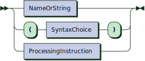
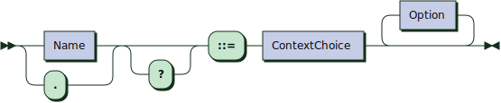
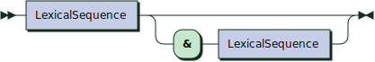
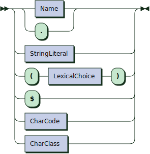
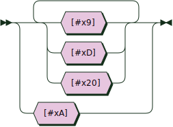
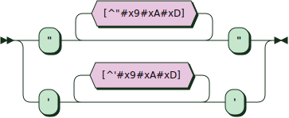
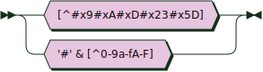
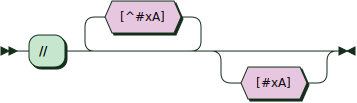
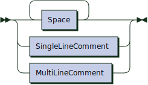

<link rel="stylesheet" href="markdown.css">

[⇦ Previous page](ebnf-notation.md) &nbsp;&nbsp;│&nbsp;&nbsp; [⇧ Back to index](../README.md#-rex-parser-generator) &nbsp;&nbsp;│&nbsp;&nbsp; [Next page ⇨ ](grammar-processing.md)

&nbsp;
# Grammar for Parsing EBNF

This is the complete grammar that REx itself uses for parsing its input grammars.

Note that different rules are used to describe syntax rules (see `SyntaxProduction`) and lexical rules (see `LexicalProduction`), each covering the distinct constructs of their respective sections.

The grammar is shown here 

 - in [EBNF](#ebnf)
 - as [Syntax Diagrams](#syntax-diagrams)

## EBNF

```
Grammar  ::= Prolog SyntaxDefinition LexicalDefinition? Encore? EOF
Prolog   ::= ProcessingInstruction*
ProcessingInstruction
         ::= '<?' Name ( Space+ DirPIContents? )? '?>'
          /* ws: explicit */
SyntaxDefinition
         ::= SyntaxProduction+
SyntaxProduction
         ::= Name '::=' SyntaxChoice Option*
SyntaxChoice
         ::= SyntaxSequence ( ( '|' SyntaxSequence )+ | ( '/' SyntaxSequence )+ )?
SyntaxSequence
         ::= SyntaxItem*
SyntaxItem
         ::= SyntaxPrimary ( '?' | '*' | '+' )?
SyntaxPrimary
         ::= NameOrString
           | '(' SyntaxChoice ')'
           | ProcessingInstruction
LexicalDefinition
         ::= '<?TOKENS?>' ( LexicalProduction | Preference | Delimiter | Equivalence )*
LexicalProduction
         ::= ( Name | '.' ) '?'? '::=' ContextChoice Option*
ContextChoice
         ::= ContextExpression ( '|' ContextExpression )*
LexicalChoice
         ::= LexicalSequence ( '|' LexicalSequence )*
ContextExpression
         ::= LexicalSequence ( '&' LexicalItem )?
LexicalSequence
         ::=
           | LexicalItem ( '-' LexicalItem | LexicalItem* )
LexicalItem
         ::= LexicalPrimary ( '?' | '*' | '+' )?
LexicalPrimary
         ::= ( Name | '.' )
           | StringLiteral
           | '(' LexicalChoice ')'
           | '$'
           | CharCode
           | CharClass
NameOrString
         ::= Name Context?
           | StringLiteral Context?
Context  ::= CaretName
CharClass
         ::= ( '[' | '[^' ) ( Char | CharCode | CharRange | CharCodeRange )+ ']'
          /* ws: explicit */
Option   ::= '/*' Space* 'ws' ':' Space* ( 'explicit' | 'definition' ) Space* '*/'
          /* ws: explicit */
Preference
         ::= NameOrString ( '>>' NameOrString+ | '<<' NameOrString+ )
Delimiter
         ::= Name '\\' NameOrString+
Equivalence
         ::= EquivalenceLookAhead EquivalenceCharRange '==' EquivalenceCharRange
EquivalenceCharRange
         ::= StringLiteral
           | '[' ( Char | CharCode | CharRange | CharCodeRange ) ']'
          /* ws: explicit */
Encore   ::= '<?ENCORE?>' ProcessingInstruction*

<?TOKENS?>

NameStartChar
         ::= [A-Z]
           | '_'
           | [a-z]
           | [#xC0-#xD6]
           | [#xD8-#xF6]
           | [#xF8-#x2FF]
           | [#x370-#x37D]
           | [#x37F-#x1FFF]
           | [#x200C-#x200D]
           | [#x2070-#x218F]
           | [#x2C00-#x2FEF]
           | [#x3001-#xD7FF]
           | [#xF900-#xFDCF]
           | [#xFDF0-#xFFFD]
           | [#x10000-#xEFFFF]
NameChar ::= NameStartChar
           | '-'
           | '.'
           | [0-9]
           | #xB7
           | [#x0300-#x036F]
           | [#x203F-#x2040]
Name     ::= NameStartChar NameChar*
Space    ::= ( #x9 | #xD | #x20 )+
           | #xA
DirPIContents
         ::= ( [^?#x9#xD#x20#xA] | '?'+ [^?>] ) ( [^?] | '?'+ [^?>] )* '?'* &'?>'
StringLiteral
         ::= '"' [^"#x9#xA#xD]* '"'
           | "'" [^'#x9#xA#xD]* "'"
CaretName
         ::= '^' Name?
CharCode ::= '#x' [0-9a-fA-F]+
Char     ::= [^#x9#xA#xD#x23#x5D]
           | '#' &[^0-9a-fA-F]
CharRange
         ::= Char '-' Char
CharCodeRange
         ::= CharCode '-' CharCode
SingleLineComment
         ::= '//' [^#xA]* #xA?
MultiLineComment
         ::= '/*' ( ( .* - ( .* '*/' .* ) ) - ( Space* 'ws' Space* ':' .* ) ) '*/'
EOF      ::= $
EquivalenceLookAhead
         ::= &( '[' ( Char | CharCode | CharRange | CharCodeRange ) ']' Whitespace? '==' )
Whitespace
         ::= ( Space | SingleLineComment | MultiLineComment )+
          /* ws: definition */
```

## Syntax Diagrams

*For the best viewing experience, [switch to GitHub light mode](https://github.com/settings/appearance).<br/>
For clickable diagrams, run the above grammar through [RR - Railroad Diagram Generator][RR].*

**Grammar:**


```
Grammar  ::= Prolog SyntaxDefinition LexicalDefinition? Encore? EOF
```

**Prolog:**


```
Prolog   ::= ProcessingInstruction*
```

referenced by:

* Grammar

**ProcessingInstruction:**


```
ProcessingInstruction
         ::= '<?' Name ( Space+ DirPIContents? )? '?>'
          /* ws: explicit */
```

referenced by:

* Encore
* Prolog
* SyntaxPrimary

**SyntaxDefinition:**


```
SyntaxDefinition
         ::= SyntaxProduction+
```

referenced by:

* Grammar

**SyntaxProduction:**


```
SyntaxProduction
         ::= Name '::=' SyntaxChoice Option*
```

referenced by:

* SyntaxDefinition

**SyntaxChoice:**


```
SyntaxChoice
         ::= SyntaxSequence ( ( '|' SyntaxSequence )* | ( '/' SyntaxSequence )+ )
```

referenced by:

* SyntaxPrimary
* SyntaxProduction

**SyntaxSequence:**


```
SyntaxSequence
         ::= SyntaxItem*
```

referenced by:

* SyntaxChoice

**SyntaxItem:**


```
SyntaxItem
         ::= SyntaxPrimary ( '?' | '*' | '+' )?
```

referenced by:

* SyntaxSequence

**SyntaxPrimary:**



```
SyntaxPrimary
         ::= NameOrString
           | '(' SyntaxChoice ')'
           | ProcessingInstruction
```

referenced by:

* SyntaxItem

**LexicalDefinition:**


```
LexicalDefinition
         ::= '<?TOKENS?>' ( LexicalProduction | Preference | Delimiter | Equivalence )*
```

referenced by:

* Grammar

**LexicalProduction:**



```
LexicalProduction
         ::= ( Name | '.' ) '?'? '::=' ContextChoice Option*
```

referenced by:

* LexicalDefinition

**ContextChoice:**


```
ContextChoice
         ::= ContextExpression ( '|' ContextExpression )*
```

referenced by:

* LexicalProduction

**LexicalChoice:**


```
LexicalChoice
         ::= LexicalSequence ( '|' LexicalSequence )*
```

referenced by:

* LexicalPrimary

**ContextExpression:**



```
ContextExpression
         ::= LexicalSequence ( '&' LexicalItem )?
```

referenced by:

* ContextChoice

**LexicalSequence:**


```
LexicalSequence
         ::= ( LexicalItem ( '-' LexicalItem | LexicalItem* ) )?
```

referenced by:

* ContextExpression
* LexicalChoice

**LexicalItem:**


```
LexicalItem
         ::= LexicalPrimary ( '?' | '*' | '+' )?
```

referenced by:

* ContextExpression
* LexicalSequence

**LexicalPrimary:**



```
LexicalPrimary
         ::= Name
           | '.'
           | StringLiteral
           | '(' LexicalChoice ')'
           | '$'
           | CharCode
           | CharClass
```

referenced by:

* LexicalItem

**NameOrString:**


```
NameOrString
         ::= ( Name | StringLiteral ) Context?
```

referenced by:

* Delimiter
* Preference
* SyntaxPrimary

**Context:**


```
Context  ::= CaretName
```

referenced by:

* NameOrString

**CharClass:**


```
CharClass
         ::= ( '[' | '[^' ) ( Char | CharCode | CharRange | CharCodeRange )+ ']'
          /* ws: explicit */
```

referenced by:

* LexicalPrimary

**Option:**


```
Option   ::= '/*' Space* 'ws' ':' Space* ( 'explicit' | 'definition' ) Space* '*/'
          /* ws: explicit */
```

referenced by:

* LexicalProduction
* SyntaxProduction

**Preference:**


```
Preference
         ::= NameOrString ( '>>' | '<<' ) NameOrString+
```

referenced by:

* LexicalDefinition

**Delimiter:**


```
Delimiter
         ::= Name '\\' NameOrString+
```

referenced by:

* LexicalDefinition

**Equivalence:**


```
Equivalence
         ::= EquivalenceLookAhead EquivalenceCharRange '==' EquivalenceCharRange
```

referenced by:

* LexicalDefinition

**EquivalenceCharRange:**


```
EquivalenceCharRange
         ::= StringLiteral
           | '[' ( Char | CharCode | CharRange | CharCodeRange ) ']'
          /* ws: explicit */
```

referenced by:

* Equivalence

**Encore:**


```
Encore   ::= '<?ENCORE?>' ProcessingInstruction*
```

referenced by:

* Grammar

**NameStartChar:**


```
NameStartChar
         ::= [A-Z_a-z#xC0-#xD6#xD8-#xF6#xF8-#x2FF#x370-#x37D#x37F-#x1FFF#x200C-#x200D#x2070-#x218F#x2C00-#x2FEF#x3001-#xD7FF#xF900-#xFDCF#xFDF0-#xFFFD#x10000-#xEFFFF]
```

referenced by:

* Name
* NameChar

**NameChar:**


```
NameChar ::= NameStartChar
           | [-.0-9#xB7#x0300-#x036F#x203F-#x2040]
```

referenced by:

* Name

**Name:**


```
Name     ::= NameStartChar NameChar*
```

referenced by:

* CaretName
* Delimiter
* LexicalPrimary
* LexicalProduction
* NameOrString
* ProcessingInstruction
* SyntaxProduction

**Space:**



```
Space    ::= [#x9#xD#x20]+
           | #xA
```

referenced by:

* MultiLineComment
* Option
* ProcessingInstruction
* Whitespace

**DirPIContents:**


```
DirPIContents
         ::= ( [^?#x9#xD#x20#xA] | '?'+ [^?>] ) ( [^?] | '?'+ [^?>] )* '?'* &'?>'
```

referenced by:

* ProcessingInstruction

**StringLiteral:**



```
StringLiteral
         ::= '"' [^"#x9#xA#xD]* '"'
           | "'" [^'#x9#xA#xD]* "'"
```

referenced by:

* EquivalenceCharRange
* LexicalPrimary
* NameOrString

**CaretName:**


```
CaretName
         ::= '^' Name?
```

referenced by:

* Context

**CharCode:**


```
CharCode ::= '#x' [0-9a-fA-F]+
```

referenced by:

* CharClass
* CharCodeRange
* EquivalenceCharRange
* EquivalenceLookAhead
* LexicalPrimary

**Char:**



```
Char     ::= [^#x9#xA#xD#x23#x5D]
           | '#' &[^0-9a-fA-F]
```

referenced by:

* CharClass
* CharRange
* EquivalenceCharRange
* EquivalenceLookAhead

**CharRange:**


```
CharRange
         ::= Char '-' Char
```

referenced by:

* CharClass
* EquivalenceCharRange
* EquivalenceLookAhead

**CharCodeRange:**


```
CharCodeRange
         ::= CharCode '-' CharCode
```

referenced by:

* CharClass
* EquivalenceCharRange
* EquivalenceLookAhead

**SingleLineComment:**



```
SingleLineComment
         ::= '//' [^#xA]* #xA?
```

referenced by:

* Whitespace

**MultiLineComment:**


```
MultiLineComment
         ::= '/*' ( ( .* - ( .* '*/' .* ) ) - ( Space* 'ws' Space* ':' .* ) ) '*/'
```

referenced by:

* Whitespace

**EOF:**


```
EOF      ::= $
```

referenced by:

* Grammar

**EquivalenceLookAhead:**


```
EquivalenceLookAhead
         ::= &( '[' ( Char | CharCode | CharRange | CharCodeRange ) ']' Whitespace? '==' )
```

referenced by:

* Equivalence

**Whitespace:**



```
Whitespace
         ::= ( Space | SingleLineComment | MultiLineComment )+
          /* ws: definition */
```

referenced by:

* EquivalenceLookAhead

## 
 <sup>generated by [RR - Railroad Diagram Generator][RR]</sup>

[RR]: https://rr.red-dove.com

[⇦ Previous page](ebnf-notation.md) &nbsp;&nbsp;│&nbsp;&nbsp; [⇧ Back to index](../README.md#-rex-parser-generator) &nbsp;&nbsp;│&nbsp;&nbsp; [Next page ⇨ ](grammar-processing.md)